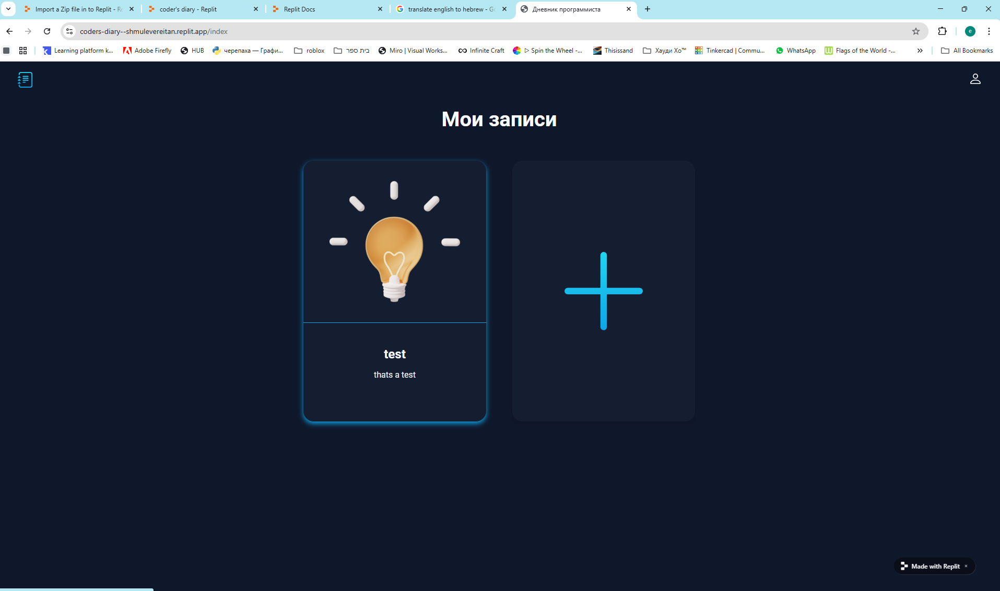

# coder-s-diary
This is a diary. You can write on it. You need to sign up to save your entries.
## instructions for running
installing dependencies
```console
pip install -r requiments.txt
```
create db
```console
python
from main import app, db
app.app_context().push()
db.create_all()
exit()
```
## results:




